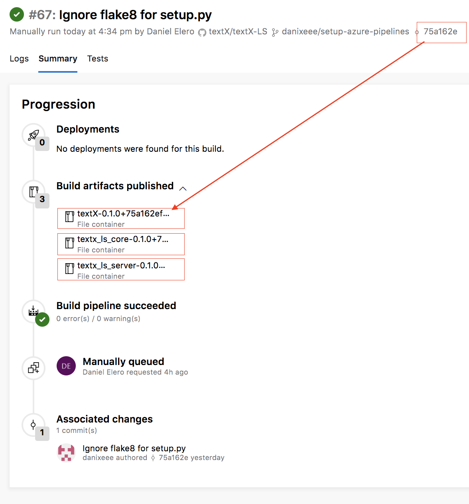

# Build Process

This project uses Azure DevOps for CI/CD process.

## Continuous Integration

Every commit to any branch triggers the build and test pipeline on four agents:

- macOS
- Linux
- Windows 32bit
- Windows 64bit

All agents are using _python 3.6_ for testing python code and checking code quality.

Each successfully built commit ends up with 3 artifacts, for e.g. (also see picture below):

- textX-0.1.0+75a162ef.vsix
- textx_ls_core-0.1.0-py3-none-any.whl
- textx_ls_server-0.1.0-py3-none-any.whl

_vsix_ artifact version is suffixed with 8 characters from git commit sha1.

---

## Continuous Delivery

NOTE: This is a plan for the future :)

Continuous delivery is triggered after pushing git tags to the master branch.

This repository contains three projects, depending on which project we want to release, we can use three types of tags:

- core-0.1.0    - uploads _textX-LS-core_ package with version _0.1.0_ to PyPI
- server-1.3.2  - uploads _textX-LS-server_ package with version _1.3.2_ to PyPI
- vscode-0.12.5 - uploads _textX_ VS Code extension with version _0.12.5_ to Marketplace
